# AWS Virtual Classroom

The **AWS Virtual Classroom** is a cloud-based web application designed to enable seamless and interactive virtual learning experiences. It integrates modern web technologies and AWS services to provide a reliable and scalable solution for educational needs.

---

## Demo Video

▶️ [Watch the demo video here](https://drive.google.com/file/d/1EjVlzxbSasXykCWdzLC20YHWMOup6tS7/view?usp=sharing)

---

## Features

- **User Authentication**: Secure login and registration for students and instructors.
- **Class Management**: Create, join, and manage virtual classrooms effortlessly.
- **Resource Sharing**: Share study materials, links, and resources.
- **Interactive UI**: A user-friendly interface optimized for responsiveness.
- **Cloud Integration**: Leverages AWS services for data storage and scalability.

---

## Technologies Used

- **Backend**: Python, Flask
- **Frontend**: HTML, CSS, JavaScript (Bootstrap)
- **Database**: SQLAlchemy
- **Cloud Services**: AWS S3 (file storage), AWS RDS (database management)

---

## Prerequisites

Ensure you have the following installed on your system:

- **Python 3.8 or higher**
- **pip** (Python package manager)
- **AWS CLI** (for AWS integrations)

---

## Screenshots

### S3 Bucket used

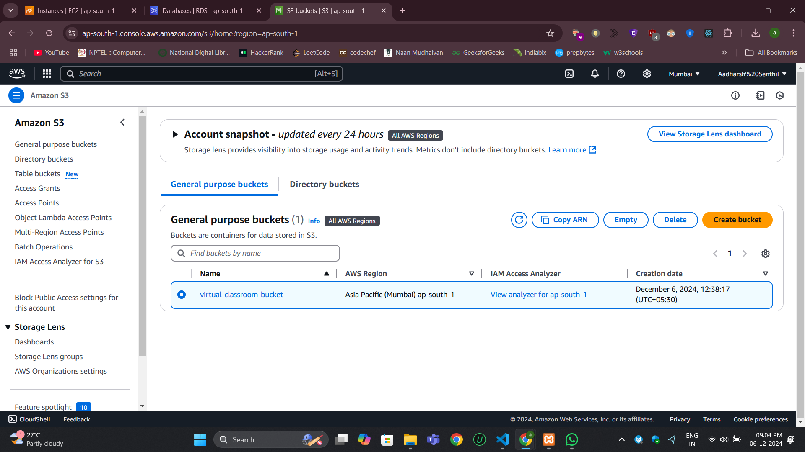

### Contents of the S3 bucket

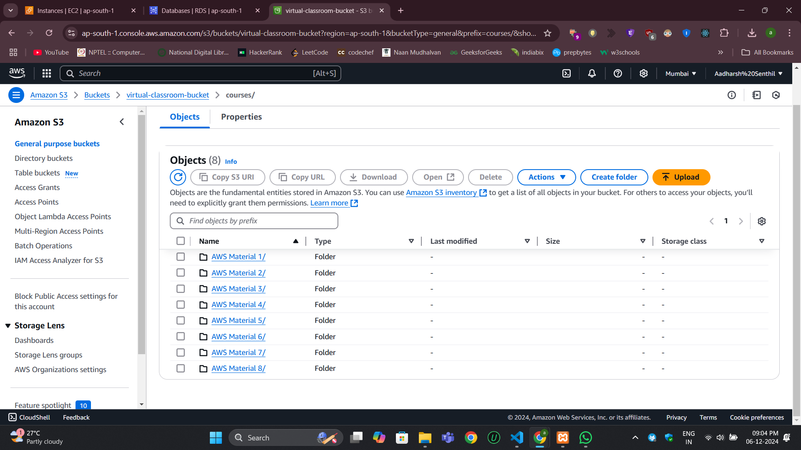

### Database used

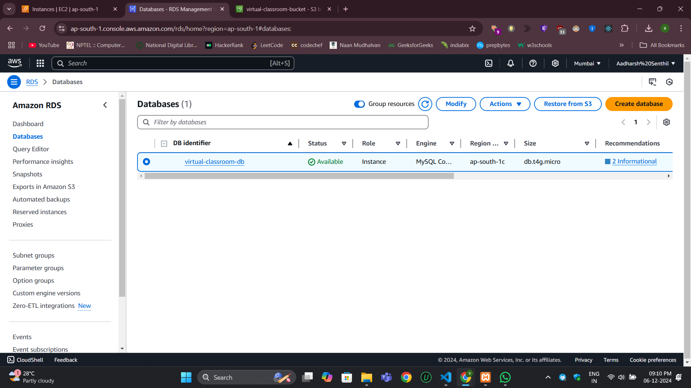

### EC2 instance

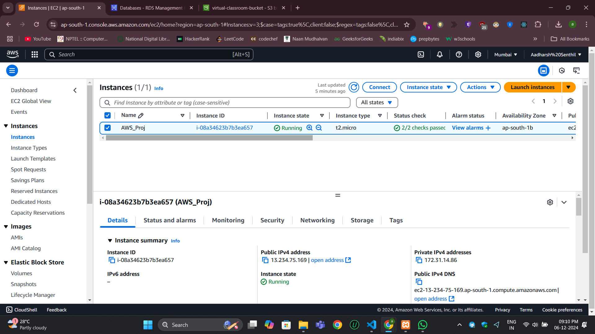

### Running the Flask Application

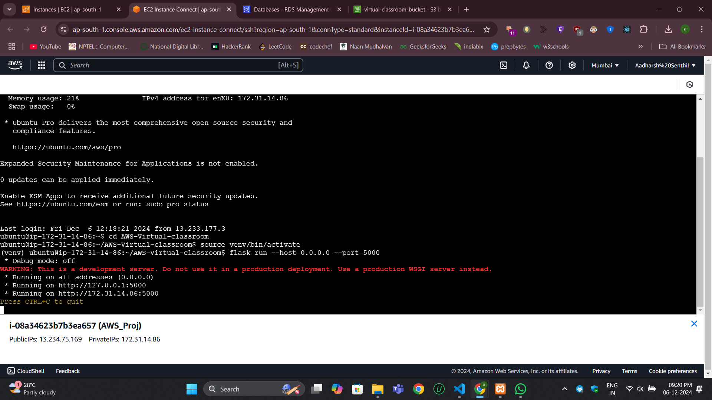

### Website index page

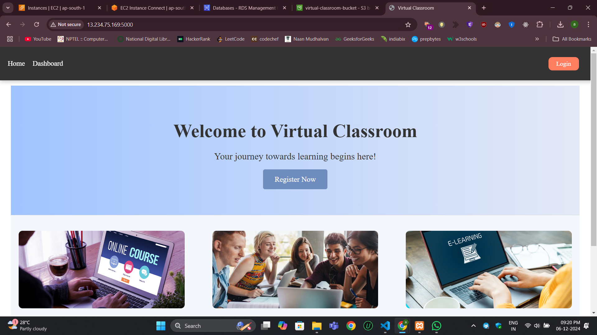

### Registration page

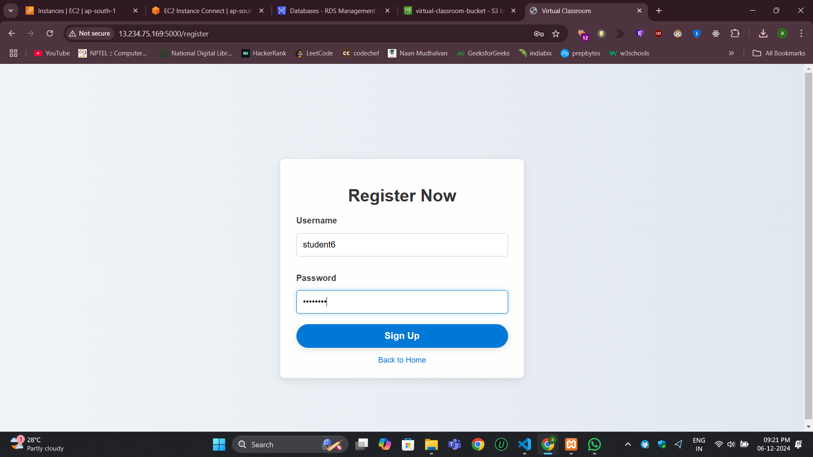

### Login page

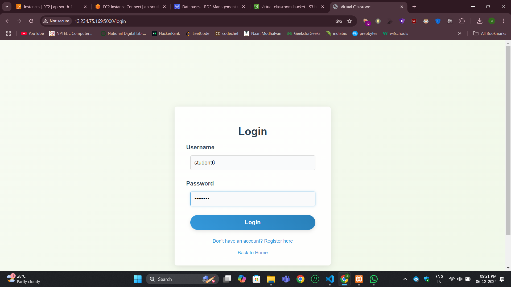

### Index page after logging in

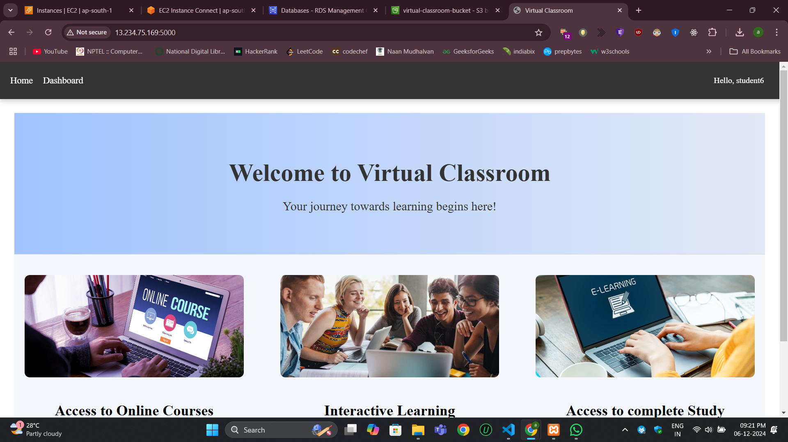

### Student dashboard (Course videos)

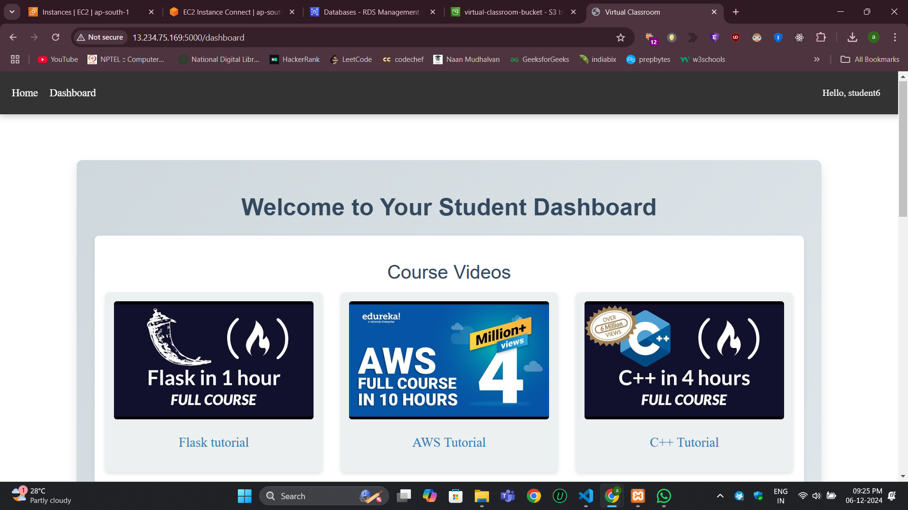

### Student dashboard (Course materials)

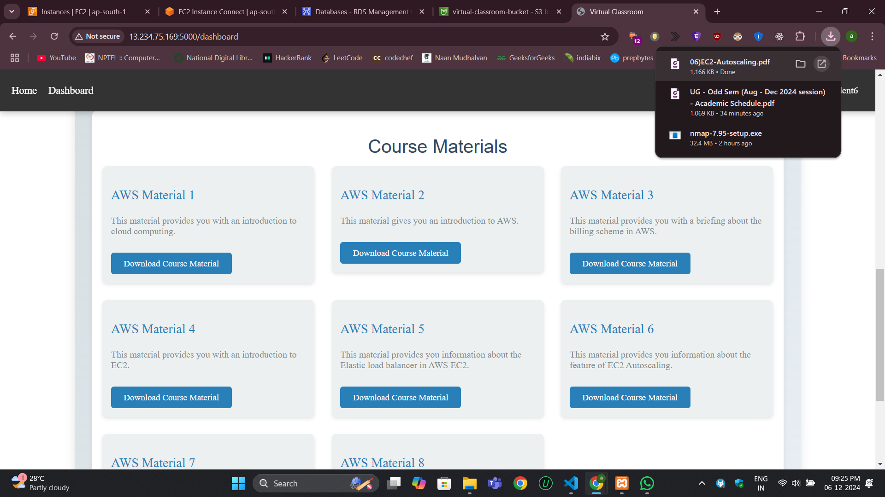

### Admin dashboard

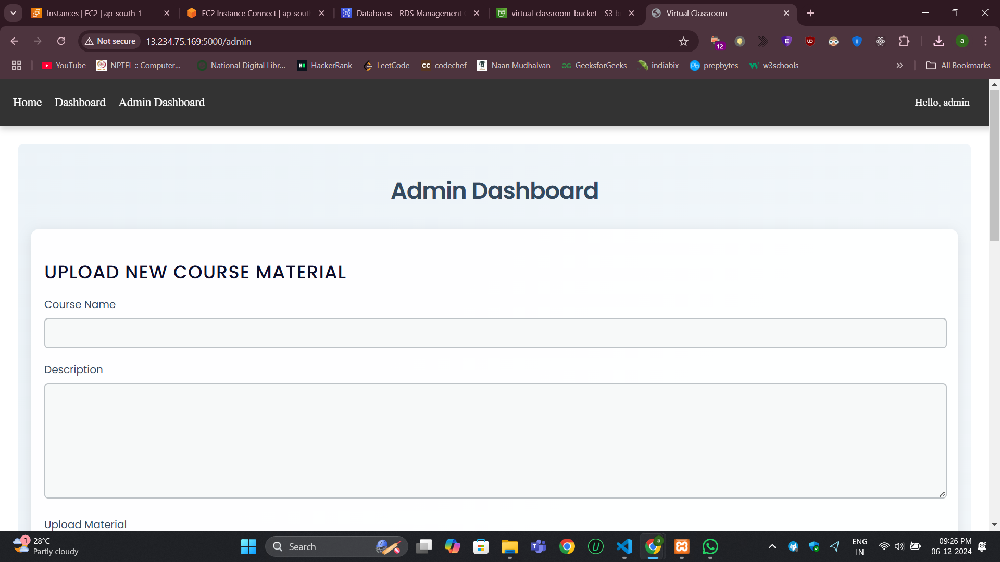

### Uploading course material

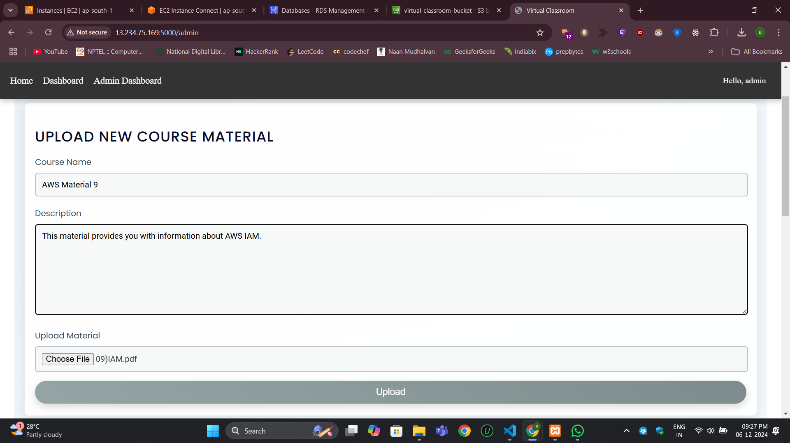

### Viewing the material in admin dashboard

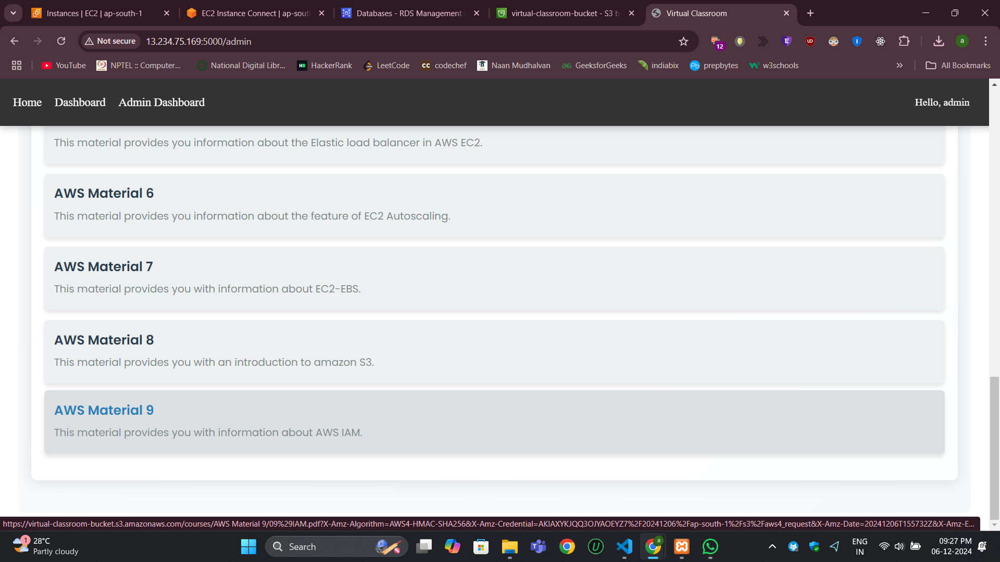

### Viewing the material in S3 bucket

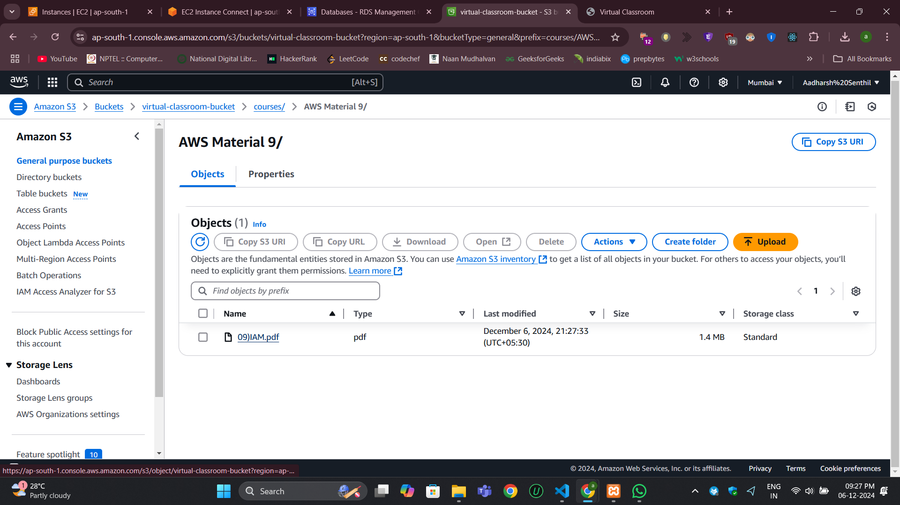
